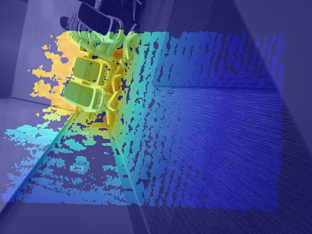

# Spot Sensor Fusion

### python 3.9+ is required!
<p>In order for this code to work with spot, you will need at least python 3.9</p>


### setup
```
pip install -r requirements.txt

```
<p>You will want to open main.py and add the username and password for your robot as they left blank for the user to fill in.</p>

<p>You will also want to add the IP address for your spot robot. If the robot is in access point mode its address will always be: 192.168.80.3</p>

<p>After those values are set you you are ready to roll. </p>

```
python main.py

```


<h1>Example Image</h1>

</img>


<h5>What you are looking at</h5>
<p>Boston Dynamics spot Robots come with both Rehular Image cameras, RGB ones on newer models and single channel ones on older ones, as well as Depth cameras. What this program essentially does is take the video from both the regular camera of your choice and its adjacent depth camera and fuse the data from both of them so that the depth imagery is overlaid on top of the visual image. This is what we call sensor fusion.</p>

### In progress


<p>Add error handling for when an invalid sensor named is passed to the depth video function</p>

<p>Get the rotation of the image correct</p>